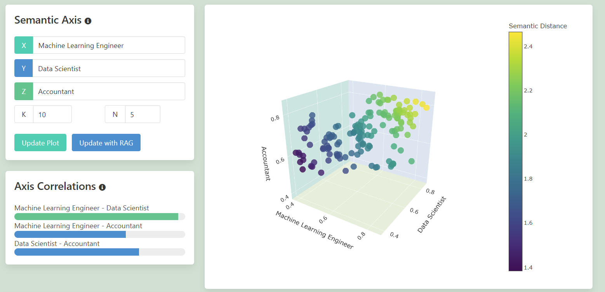
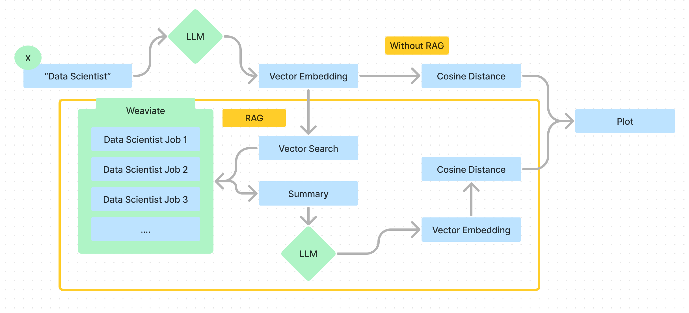
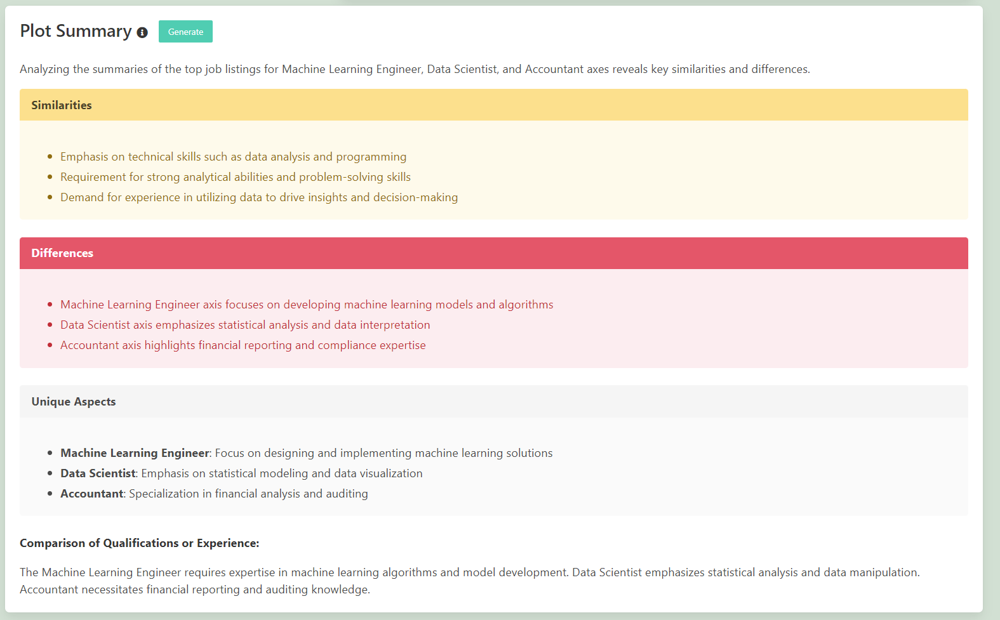

# VectoredIn 📈🔍

Welcome to the VectoredIn repository! This project is my submission for the Weaviate Machine Learning Engineer challenge. It aims to provide a powerful tool for analyzing and visualizing job market data using Weaviate.

See it live! https://app.nbdata.co

Weaviate: https://weaviate.io/

##  Project Overview

VectoredIn is a web application that allows users to explore and gain insights from job market data. It leverages the power of natural language processing (NLP) and machine learning techniques to process and analyze job listings. 

## Features 

### 3D Plot of Semantic Distance

Here's an example of the 3d Scatterplot.

On the left hand side is where the 3 axis are set, which can be adjusted and the plot updated. Below that show's the linear correlation between the 2d permutations between the 3 axis.

### RAG Search

RAG is a technique that enhances large language model's by providing additional context when querying. In the context this project, RAG add's in an additional step between our provided axis and their embedding. Here's a quick representation of how this work's in this application:

### Plot Summary

This plot summary is a general summary of the job listings and summarization of the similarities and differences. It works in essentially 3 steps:

1. The closest 5 similar job listings are taken and then summarised using Weaviates generative serach.
2. These are then aggregating into a meta-analysis prompt using OpenAI 3.5-turbo model.
3.  This is then output as the inner html to the box.

##  Technologies Used

-  Python
-  Django web framework
-  HTML, CSS, JavaScript
-  Plotly for interactive visualizations
-  OpenAI API for generating embeddings
-  Hierarchical Navigable Small World (HNSW) algorithm for efficient similarity search
-  Weaviate for vector storage and retrieval

## Highlights

### BestWorst Search

##  Features

-  Semantic analysis on job postings related to AI and Machine Learning
-  Interactive 3D visualization of job data based on user-defined keywords
-  Customizable axis labels for data exploration
-  Real-time updates and dynamic plot generation
-  Detailed job summary and alignment analysis
-  User-friendly interface with modern design

## 📂 Repository Structure

  - `myapp/`: Main application directory
    - `templates/`: HTML templates for the web interface
    - `hnsw/`: Tools for python HNSW
    - `generative/`: Generative tools for website
    - `views.py`: Backend logic for handling requests and data processing
    - `models.py`: Data models for the application
    - ...
- `notebooks/`: Jupyter notebooks for data exploration and model development
- `data/`: Directory for storing job market datasets
- `static/`: Static files (CSS, JavaScript, images)
- ...
